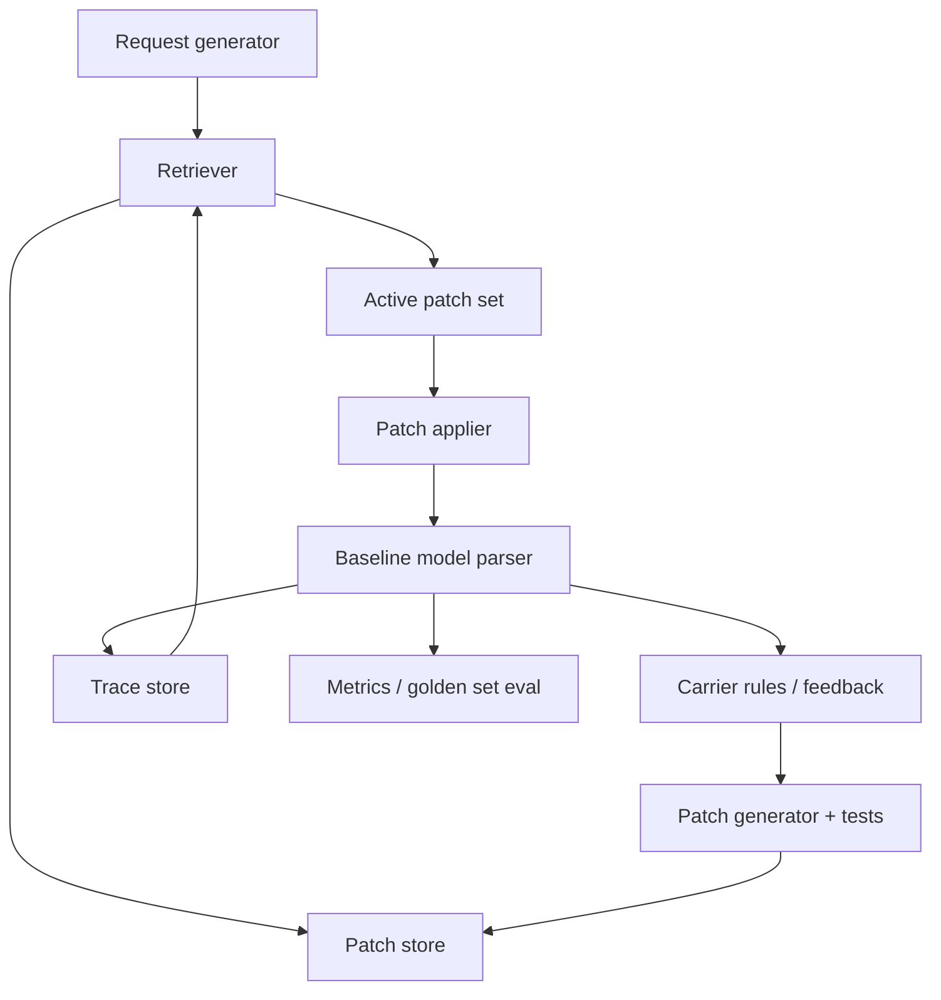

# PatchLab: a tiny simulation of context‑driven performance gains

This repo is a **blog‑style runnable demo**. The goal is not to build a perfect shipping system, but to build intuition: **how can context (retrieval + patches) improve product performance without changing model weights?**

If you have ever shipped an LLM feature and wondered “Can we improve accuracy without fine‑tuning?”, this toy sim gives you a concrete, observable loop.

---

## The idea in one paragraph

We simulate a shipping quote “skill” that parses a natural‑language request. The baseline model is noisy and incomplete, like a real LLM. A carrier API provides error codes (prohibited item, embargo destination, overweight parcel, etc.). When the model makes a mistake, we automatically create a **patch** (a small rule or example), gate it with tests, and then retrieve/apply it on future runs. Over time, the model seems to “learn” edge cases because the **context** is changing, not the weights.

---

## The real question this demo answers

> How does context engineering improve product performance in the absence of fine‑tuning?

This simulation shows:
- where the baseline fails
- how patches are generated from feedback
- how retrieval applies patches at runtime
- how accuracy and precision/recall improve as patches accumulate

---

## The scenario

We process requests like:

```
Ship 2 kg books box to US
Ship 1 kg battery box to EU
Ship 5 kg books letter to EU
```

Each request includes:
- weight + unit
- destination
- item
- parcel type

The carrier has rules (the system must obey them):
- prohibited items (weapon, fireworks…)
- hazmat items (battery, paint…)
- liquid restrictions (perfume/alcohol only in certain parcels)
- embargo destinations (iran, north korea…)
- parcel weight limits

The baseline model knows only a subset of these rules. It also has deterministic “noise” (simulated LLM mistakes).

The carrier API acts as the **feedback loop**: it returns error labels that we treat as the truth signal.

---

## What is a “patch” here?

A patch is a small, structured rule:

- **Trigger**: a word or phrase in the request (e.g., `battery`, `oz`, `iran`)
- **Fix**: update the configuration (add unit conversion, add embargoed destination, mark item as hazmat, etc.)
- **Tests**: a tiny regression suite so patches don’t break known‑good cases

Patches are **gated**. Only patches that pass tests become active and retrievable.

---

## The loop (step‑by‑step)

1) **Generate a request** (mix of common cases and edge cases)
2) **Retrieve patches** (top‑K similar or relevant patches)
3) **Apply patches** to the model’s config
4) **Run the model** with the patched config
5) **Get carrier feedback** (error label or OK)
6) **If failure, create a patch** and gate it
7) **Store the trace** for future retrieval

In practice, this is how “learning” happens without fine‑tuning: the model is stable, but the **context evolves**.

---

## System architecture (high‑level)



The system runs a closed loop: a request is parsed by a noisy baseline model, errors are surfaced by the carrier feedback, and those errors are converted into small, test‑gated patches that get stored and retrieved in later runs. Because improvements arrive through retrieved context rather than weight updates, performance gains are narrow and local: the model gets better only on patterns captured by patches, and it can still fail on unseen or ambiguous cases (or when patches overfit to the synthetic rules). This is intentional — the demo isolates the strengths and limitations of context‑driven iteration rather than claiming general intelligence.

---

## What to look for in the output

The report shows:
- baseline vs patched success rate
- failure clusters by error label
- patch creation stats (created / active / quarantined)
- golden set accuracy and **precision/recall per label**

There’s also a **verbose trace mode** that prints, run by run:
- which patches were retrieved
- which were applied
- when patch creation happened
- the baseline vs patched step‑by‑step parse

---

## Run it

```bash
python src/main.py --runs 1000 --seed 7 --show 5
```

Useful flags:

```bash
--verbose          # print step-by-step traces
--trace 5          # number of traces to print
--noise 0.03       # model noise rate
--golden 40        # golden set size for precision/recall
```

Example trace output (trimmed):

```
=== TRACE RUN 12 ===
request: Quote for 0.5kg clothes tube -> US
retrieve patches: ['074a5d0f43', ...]
apply patches: ['074a5d0f43']
patch events:
  - failure_label: parcel_unknown
  - create_patch: 074a5d0f43 trigger='tube' status=active tests=pass

[baseline]
  - find parcel -> None
  - error: parcel_unknown

[patched]
  - find parcel -> tube
  => OK ...

[carrier feedback] ok
```

This shows the intuition: without patches, the model fails; with patches, it succeeds.

---

## How the “golden set” works

We keep a fixed list of labeled requests. This acts as an offline benchmark:
- **precision/recall** per error label
- a quick read on whether patches are helping the right cases

This mirrors how you might evaluate a production change with a curated test suite.

---

## File tour

- `src/patchlab/toy_app.py` — parsing + carrier rules + feedback
- `src/patchlab/engine.py` — simulation loop, patch generation, gating, retrieval
- `src/patchlab/measurement.py` — metrics and precision/recall
- `src/patchlab/stores.py` — patch + trace stores (vector retrieval)
- `src/patchlab/embed.py` — lightweight hashing embedder
- `src/main.py` — CLI entrypoint

---

## Limitations (because it’s a toy)

- The “carrier API” is simulated, not real.
- Patches are simple string‑trigger rules (no learned embeddings or complex logic).
- The model is just parsing rules with noise, not a real LLM.

Even with those simplifications, the **pattern** holds: feedback → patches → retrieval → better performance.

---

## If you want to extend it

- Add new rule classes (fragile, temperature‑controlled, insurance)
- Increase the golden set and add adversarial cases
- Track “time‑to‑fix” per failure class
- Replace the hashing embedder with a real embedding model

---

## Why this matters

Most real products don’t have the luxury of fine‑tuning every week. But they *do* have logs, failures, and constraints. This demo makes the case that **context can be your learning mechanism** — if you systematically capture errors and turn them into patches.
